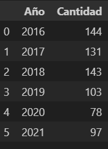
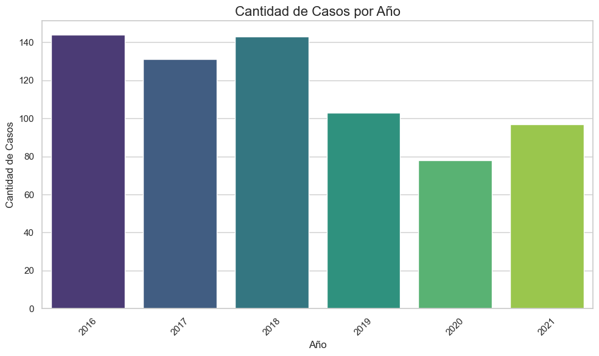
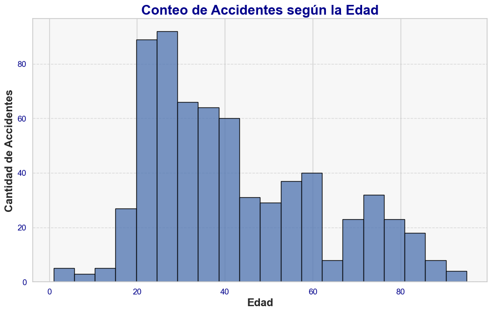
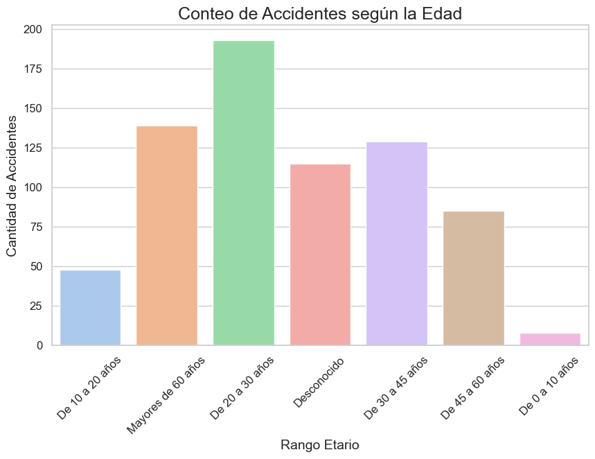

# <h1 align=center> **PROYECTO INDIVIDUAL Nº2 SOY HENRY** </h1>

# <h1 align=center>**`SINIESTROS VIALES FATALES EN LA CIUDAD DE BUENOS AIRES`**</h1>

En este proyecto se lleva a cabo un análisis exhaustivo de los siniestros viales fatales ocurridos en la Ciudad de Buenos Aires. El objetivo es identificar patrones relevantes en cuanto a las características de las víctimas, las zonas más afectadas y las circunstancias de los accidentes, con el fin de proponer recomendaciones de mejora para la seguridad vial.

## Fuente de datos

El dataset fue obtenido de la base de datos del Observatorio de Movilidad y Seguridad Vial de la Ciudad Autónoma de Buenos Aires. Consta de dos datasets, uno llamado HOMICIDIOS que contiene información de accidentes fatales desde el año 2016 al 2021, incluyendo la ubicación del hecho, vehículos involucrado, y comuna a la que corresponde. El segundo set de datos es de víctimas, contando con el sexo, edad y rol de las mismas al momento del hecho. Contamos también con diccionario de datos con información específica de cada variable.

## ETL (Extracción, Transformación y Carga)

Se realizaron los siguientes pasos para preparar el dataset y facilitar su análisis posterior:
   
 **Transformación**:
   - Se analizaron valores faltantes y se eliminaron registros duplicados.
   - Se verificaron los tipos de datos de cada columna, para ver si correspondían. Caso contrario se los modificaba.
   - Se crearon nuevas columnas para agrupar datos, como:
     - Rangos de edad para las víctimas.
   - Se estandarizaron los nombres de las columnas como cruce, lugar del hecho, dirección normalizada.
   - Se creó un solo dataset con todas las columnas relevantes.

 **Carga**: 
   - El dataset limpio se guardó en formato CSV para su posterior uso en el análisis y visualización en PowerBI.

## EDA (Análisis Exploratorio de Datos)

Durante el análisis exploratorio, se identificaron varios patrones clave:

### Faltantes:
- El dataset fue depurado eliminando los valores nulos, de forma que no quedan registros faltantes en las columnas relevantes.

### Duplicados:
- No se encontraron registros duplicados en el dataset luego de su limpieza.

### Variables Cuantitativas y Cualitativas

Se identificaron las variables cuantitativas como edad de las víctimas y cantidad de siniestros, y cualitativas como calle, comuna, tipo de calle, etc. Se evaluó cada columna por separado.

#### Número de víctimas

Como se puede observar la mayoría de los accidentes involucran una sola víctima.

#### Columnas relativas a la fecha

Se trató de corroborar los tipos de datos, que estén en el formato adecuado y se procedió a explorar primero la cantidad de registros por año, luego por mes, día y hora.

    
    

Como conclusión podemos decir que:
+ El año con mayor accidentes fue 2016, con prácticamente el mismo nivel de registros que 2018. 
+ El día del mes que cuenta con mayores registros fue el 20.
+ El mes de diciembre tiene más siniestros, lo que puede deberse a la época del año donde coincide el comienzo de las vacaciones escolares y las fiestas de fin de año.
+ El horario con más accidentes registrados fue a las 7 de la mañana, lo que puede deberse a que las personas se movilizan para ir a trabajar, por ende una mayor circulación de vehículos.

#### Columnas relativas al lugar geográfico del hecho
Se trató de normalizar los nombres de las calles y cruces, y se limpió el dataset de caracteres extraños.
También se añadió el nombre de las comunas para un mejor análisis posterior.

Como conclusión podemos decir que:
+ Las comunas con más registros son 1,9 y 4. 
+ Las avenidas son los tipos de calles que más accidentes registran.

#### Columnas sobre los involucrados

Al igual que con las otras columnas, se revisaron los valores únicos y se identificaron posibles anomalías para asegurarse de que los datos sean consistentes. Además, se realizaron ajustes para garantizar que las categorías coincidieran correctamente con la información oficial disponible.

En paralelo, se verificó que todas las categorías presentes en el DataFrame estuvieran explicadas en el PDF del gobierno, corroborando su coherencia. Un ejemplo de esto es la columna "ACUSADO", donde se identificó que la categoría "PASAJEROS" se repetía. Se concluyó que "PASAJEROS" correspondía a un rol dentro del incidente, y no a un acusado en sí. Además, al no encontrarse registros específicos de transporte público, se infirió que "PASAJEROS" en la columna "ACUSADO" hacía referencia a incidentes que involucraban a transporte público.

Las conclusiones que podemos sacar en base a este gráfico son:
+ Los vehículos en mayoría que son las víctimas del hecho son motos.
+ Los vehículos que más se presentan como la contraparte a la víctima son autos.

#### Distribución de las Víctimas por Edad

<table align="center">
  <tr>
    <td>
      
    </td>
    <td>
      
    </td>
  </tr>
</table>

Con este gráfico podemos concluir que la mayor cantidad de casos de víctimas tienen entre 20 a 30 años, hay un registro que se podria considerar outlier de 95 años, la media es 42 y el mínimo registrado de edad es 1.

#### Sexo de las víctimas

Podemos concluir que existe una cantidad mayor significativa de víctimas masculinas que femeninas y tenemos seis datos que no se sabe el género.

#### Rol de las víctimas

La mayoría de los datos con los que contamos, son víctimas que eran conductores o peatones.

### Conclusiones del EDA

- **Sexo y Edad**: La mayoría de las víctimas son hombres entre 20 y 30 años, seguidos por personas mayores de 60 años.
- **Tipos de Vehículos Involucrados**: Las motocicletas y los peatones son las categorías más frecuentes de víctimas en los siniestros viales.
- **Ubicación**: Las comunas 1, 4 y 9 concentran la mayor cantidad de siniestros, siendo la comuna 1 la más crítica para peatones.
- **Temporalidad**: Noviembre y diciembre son los meses con mayor cantidad de accidentes fatales, y las horas pico de la mañana (06:00 a 07:00) tienen mayor incidencia.

### Análisis bivariable

Se quiso hacer un mapeo de las relaciones y posibles correlaciones entre variables.

Se realizó un análisis exhaustivo del sexo, la edad y el rol de las víctimas. Los resultados muestran que la mayoría de los accidentes involucran como víctimas a hombres, principalmente en el rango de edad de 20 a 30 años. En cuanto a los peatones, se observó una mayor equidad de género, destacándose las personas mayores de 60 años como el grupo más afectado.

## Dashboard POWERBI

Con los datos limpios y listos, se construyó un dashboard interactivo en PowerBI que permite visualizar los patrones en diferentes zonas y momentos del día, facilitando la toma de decisiones informadas para mejorar la seguridad vial.

### KPI

- *Reducir en un 10% la tasa de homicidios en siniestros viales de los últimos seis meses, en CABA, en comparación con la tasa de homicidios en siniestros viales del semestre anterior*.
  
  Definimos a la **tasa de homicidios en siniestros viales** como el número de víctimas fatales en accidentes de tránsito por cada 100,000 habitantes en un área geográfica durante un período de tiempo específico.

  
- *Reducir en un 7% la cantidad de accidentes mortales de motociclistas en el último año, en CABA, respecto al año anterior*.

  Definimos a la **cantidad de accidentes mortales de motociclistas en siniestros viales** como el número absoluto de accidentes fatales en los que estuvieron involucradas víctimas que viajaban en moto en un determinado periodo temporal.
  

- *Evaluar la situación actual de tasa de mortalidad en comparación con la tasa de mortalidad a nivel país, con datos estadísticos del gobierno de la República Argentina*.

## Conclusiones Finales

## Recomendaciones

